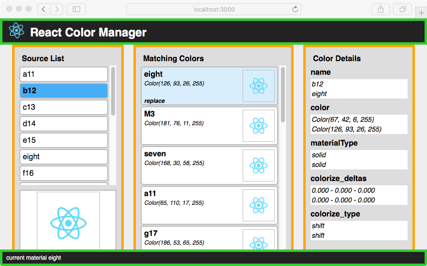

[<< Create a React App](./create_react_app.md) 
[Connect Ruby and JS >>](./connect_ruby_with_js.md)

---

## Building the React UI

### The App Component

 

In React a UI is built out of `components`. The top level component `App` creates the header and footer (green) and displays the list compontents in its main area (orange).  

#### The Component State

The main component also manages the state of the app and communicates changes of the state to the sub-components. In our application we only have one component that needs to handle state. 

```javascript
class App extends Component {
  constructor(props) {
    super(props);

    this.state = {
      match: '',
      error: '',
      materials: {},
      source: '',
      status: '',
      thumbnails: {}
    };

    this.replaceMaterial = this.replaceMaterial.bind(this);
    this.selectMatch = this.selectMatch.bind(this);
    this.selectMaterial = this.selectMaterial.bind(this);
  }
  ...
```

The state object holds the following keys:

<dl>
  <dt><code>match</code></dt>
  <dd>The name of the selected <em>matching</em> material</dd>

  <dt><code>error</code></dt>
  <dd>If an error happens during the execution of Ruby code this value will hold the error message.</dd>

  <dt><code>materials</code></dt>
  <dd>A JavaScript object with the materials used in the SketchUp model. The materials names are used as keys.</dd>

  <dt><code>source</code></dt>
  <dd>The name of the selected <em>source</em> material</dd>
  
  <dt><code>status</code></dt>
  <dd>The status holds the message displayed in the footer. If it is set to `error` the message in the error property is displayed instead.</dd>
  
  <dt><code>thumbnails</code></dt>
  <dd>Thumbnails are generated in Ruby and sent to the dialog as Base64 encoded strings. The strings are held in this object by their material name.</dd>

</dl>

In the constructor we also need to bind all methods to the App component that refer to the app state via `this.state`. We only have functions to select the source and match material and to trigger the material replacement. These functions will be passed to the sub-components to act as the `onClick` action of the list elements.   


#### Lifecycle Methods

A React component has several hooks - or *lifecycle methods* - that are invoked at specific times. We will use two of these in our component:

**`componentDidMount`** This method is invoked after the component was created in the DOM. We use it to automatically load the list of materials after the dialog has been created. Think of it as an `onload` event for React. The loading happens in two steps: The first only loads the material description to populate the UI with the material names. The second generates and loads the thumbnails. This could take a while but the user already has the material names to make a selection. 

**`componentWillReceiveProps`** is invoked every time an existing component is updated with new data. Our component receives new data after a Ruby function is executed. This data may only update a small part of the state so we need to merge it with the existing data that's already held in the state. 

> Note: In the code below we use the helper function `sketchupAction`. This function provides an abstraction around the global `sketchup` object, which is not available during development with the dev server.


```javascript
  ...
  // load materials immediately after app component is created
  // and set timeout to load thumbnails
  componentDidMount() {
    console.log('componentDidMount');
    sketchupAction({ type: 'LOAD_MATERIALS' });
    setTimeout(() => sketchupAction({ type: 'LOAD_THUMBNAILS' }), 500);
  }

  // update state with new state received via nextProps
  componentWillReceiveProps(nextProps = {}) {
    const merged = mergeProps(this.state, nextProps.data);
    this.setState(merged);
  }
  ...
```

#### *Action* Methods

The following methods implement the behavior of the app. In the React model a user action does not directly affect or change the elements in the browser. Instead, the action changes the state of the application. React will then rerender the DOM based on the new state and this generates the change in the user interface.

In our app, the `selectMatch` and `selectMaterial` functions use the component's `setState` function to update the state with new information (the name of the selected material and a status message). `setState` also triggers React's `render` function so the new state is displayed in the browser.

In both select functions we also reset the `error` value of the state to an empty string. This makes sure that the new `status` is displayed, even if there was an error present before. The second argument to `setState` is a function that logs the current action to the console so we can follow the events in the browser console.    

In addition to setting the state, the `replaceMaterial` function also calls `sketchupAction` with an action of type `REPLACE_MATERIAL` and the names of the materials. Because the call to the SketchUp callback function is asynchronous the interface will be updated even if the Ruby action is still ongoing. In a more complex UI we could show a spinner to show the user that the action is still ongoing. In our case we just update the status bar with a suitable message.

```javascript
  ...
  // set name of color selected in 'matching' list
  selectMatch(name) {
    this.setState(
      { match: name, status: `match material ${name}` },
      () => console.log(`selected match material '${name}'`)
    );
  }

  // set name of source material and reset match selection
  selectMaterial(name) {
    this.setState(
      {
        source: name,
        match: '',
        status: `selected source material '${name}'`
      },
      () => console.log(`selected source material '${name}'`)
    );
  }

  // trigger action to replace match material with source material
  replaceMaterial(name) {
    if (!this.state.source) {
      return;
    }

    // update the state to provide user feedback
    this.setState(
      {
        status: `replacing material '${name}' with '${this.state.source}'`
      },
      () => console.log(`replaceMaterial(${name})`)
    );

    // call sketchup.su_action with the correct action
    sketchupAction({
      type: 'REPLACE_MATERIAL',
      payload: {
        replace: name,
        replace_with: this.state.source,
      }
    });
  }
  ...
```

#### Status Message
 
The status message for the footer is generated from the error and status properties of the state. We check if the `status` indicates that there is an error present and if so wrap it in a span with the CSS class `error`. Otherwise we just displays the latest status message. This can easily be extended to show a modal overlay to catch the user's attention.

```javascript
  ...
  const statusmsg =
    this.state.status === 'error' ? (
      <span className="error">{this.state.error}</span>
    ) : (
      this.state.status
    );
  ...
```

#### The Render Method

The render method returns the ESX markup for the component's content. The App component generates the header and footer and calls the list components for the content of the `App-body` div.

The list components take the list of materials, any existing selections and the callbacks and build the panels with the header and `ul` element. Each `li` element has the callback as its `onClick` function so that a click on the element triggers a state change in the app.

```javascript
  ...
  render() {
    const statusmsg =
      this.state.status === 'error' ? (
        <span className="error">{this.state.error}</span>
      ) : (
        this.state.status
      );

    return (
      <div className="App">
        <div className="App-header">
          
          <h2>React Color Manager</h2>
        </div>

        <div className="App-body">
          <ColorList
            title={'Source List'}
            materials={this.state.materials}
            onSelect={this.selectMaterial}
            source={this.state.source}
            thumbnail={this.state.thumbnails[this.state.source]}
          />

          <ColorDiffList
            title={'Matching Colors'}
            match={this.state.match}
            materials={this.state.materials}
            onmatch={this.selectMatch}
            onReplace={this.replaceMaterial}
            source={this.state.source}
            thumbnails={this.state.thumbnails}
          />

          <ColorDetails
            source={this.state.materials[this.state.source] || {}} 
            match={this.state.materials[this.state.match] || {}}
          />
        </div>

        <div className="App-footer">{statusmsg}</div>
      </div>
    );
  }
}
``` 

### Next steps

Our app is now running in the webpack dev server. In the next steps we will connect the JavaScript UI with the Ruby backend.

---

[<< Create a React App](./create_react_app.md) 
[Connect Ruby and JS >>](./connect_ruby_with_js.md)