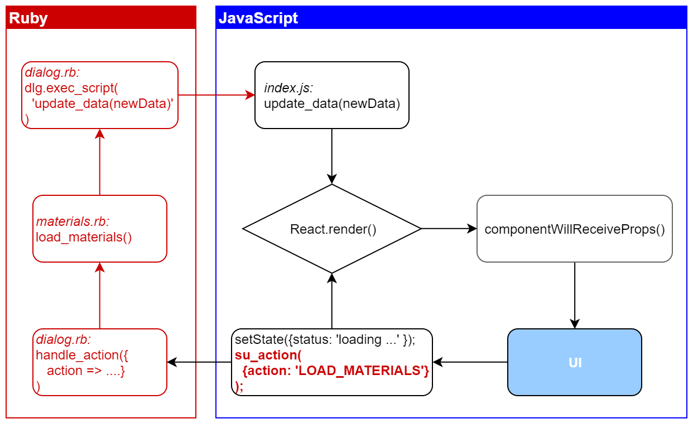

[<< Connecting Ruby and JavaScript](./connect_ruby_with_js.md)
[Back to Index](./index.md)

---

## Connecting the App

We have established the basics of exchanging data between Ruby and JavaScript. To apply this in our app we have to extend the Ruby callback to process the action sent from the dialog and send the result back as a JSON string. The typical update cycle will look something like this:



1. A user interaction triggers a function.
2. The function calls `setState` to update the interface with a new state. It also passes an action to the Ruby `su_action` callback that is then sent to `process_action`.
3. `process_action` evaluates the type of the action, runs the corresponding Ruby function and creates a response object.
4. `dialog.execute_script` is used to run the JavaScript `update_data` function with the response object as argument.  
5. `update_data` calls `React.render` which passes the new data to the App component as props.data.
6. `App.willReceiveProps` merges the new data set with the component state and rebuilds the interface.
7. A user interaction triggers a function ...

Strictly speaking, only the `REPLACE_MATERIAL` action will be processed in this way. The selection of a material bypasses the Ruby side and just triggers a UI update via `setState`.

### The Ruby Callback

At first we need to extend the Ruby action callback to process the action and return the response object to the dialog.

```ruby
  ...
  # define 'su_action' callback to be used from JavaScript
  dlg.add_action_callback("su_action") { |action_context, action|
    self.log_action(action)

    response = self.process_action(action)
    js_command = 'update_data(' + response.to_json + ')'
    dlg.execute_script(js_command)
  }
  ...
```

### Processing the Action

The `process_action` function will handle all action requests sent from the dialog. It always has to return a valid response object. Therefore we define a simple response first and wrap the processing part in a `begin ... end` block. The initial response is an error message to signal to the user that something went wrong. If the action processing succeeds the response is redefined with the new data to display in the dialog.

The first action we have to consider is loading the list of materials. The action is identified by the type of `LOAD_MATERIALS`. The response object contains a status message and the key `materials` which has a hash of materials as its value. The hash is provided by the `get_material_hash` function.

In a similar way we can define an action to load the material thumbnails (`LOAD_THUMBNAILS`). 

```ruby
module SketchupReactDemo
  module_function

  def process_action(action)
    puts 'processing action ...'
  
    # Begin with an error message to flag if something goes wrong.
    response = {'error' => 'unknown action type', 'status' => 'ERROR'}
    
    begin
      
      if action['type'] == 'LOAD_MATERIALS'
        response = { 
          'materials' => self.get_material_hash,
          'status' => 'materials loaded'
        }
      end

      if action['type'] == 'LOAD_THUMBNAILS' then
        response = {
          'thumbnails' => self.get_thumbnails_hash,
          'status' => 'thumbnails loaded'
        }
      end
      
      if action['type'] == 'REPLACE_MATERIAL'
        # implementation see below
      end

    # in case of an exception replace the existing error message with
    # the exception's error message 
    rescue => e
      puts e
      response = {'error' => e, 'status' => 'ERROR'}
    end
    
    self.log_response(response)
    return response
  end

end 
```

To replace a material (action type `REPLACE_MATERIAL`) we also need to provide the name of the material to replace (`replace`) and the name of the replacement material (`replace_with`) in the action payload.

The response for this action will be a new list of model materials (now without the replaced material) which will replace the list that is already loaded in the dialog. To the user the replaced material will simply vanish from the list. 

```ruby
      ...
      if action['type'] == 'REPLACE_MATERIAL'
          replace = action['payload']['replace']
          replace_with = action['payload']['replace_with']
          self.replace_material(replace, replace_with)
          
          response = {
            'materials' => self.get_material_hash,
            'status' => "replaced '#{replace}' with '#{replace_with}'"
          }
      end 
      ...
```

### Updating JavaScript Data

In the JavaScript code we have to define the `update_data` function that can be called via the `execute_script` method of the dialog instance. This function has to be defined directly on the global object or it will be hidden in a JavaScript closure by the bundler.

The default configuration for the ESLint style checker does not allow global definitions. To avoid errors during the compilation we have to disable this rule with the `eslint-disable-next-line` comment.

The only action that `update_data` needs to perform is to rerender the App with the newly provided data. The new data is then available to the component as as `props.data`. 

```javascript
...
// eslint-disable-next-line
global.update_data = function(newData) {
  console.log('=> update_data');
  console.log(JSON.stringify(Object.keys(newData), null, 2));
  ReactDOM.render(<App data={newData} />, document.getElementById('root'));
}
...
```

The real update happens in the `componentWillReceiveProps` which calls the `mergeProps` function with the existing state and the new data to be merged. The `error`, `materials` and `status` properties are replaced with the new new data objects (if present). The `thumbnails` object will be updated with the new information which allows us to send individual thumbnails to the dialog. We also don't need to remove thumbnails that already exist. They will simply not be used. 

The object returned from `mergeProps` will be used to update the component's state. It does not contain the `source` and `match` properties, so the existing selection state is not affected by the update. 

```javascript
...
// replace error, materials and status but update thumbnails
function mergeProps(state, newProps = {}) {
  return {
    error: newProps.error || '',
    materials: newProps.materials || state.materials || {},
    status: newProps.status || state.status || '',
    thumbnails: Object.assign({}, state.thumbnails, newProps.thumbnails)
  };
}
...
```

With this function we have all the elemnts that are necessary to receive data in JavaScript and update the interface accordingly.

---

[<< Connecting Ruby and JavaScript](./connect_ruby_with_js.md)
[Back to Index](./index.md)