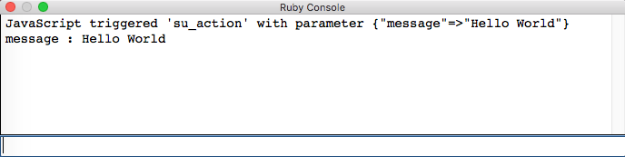
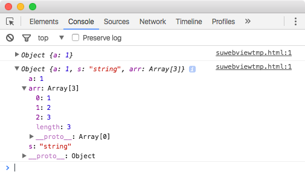

[<< Building the UI](./build_app_ui.md) 
[Connecting the UI >>](./connect_app.md)

---

## Connecting Ruby and JavaScript

With the basic React app running in the HtmlDialog window we need to establish communication from the dialog to our Ruby code and vice versa.

### Sending Data to Ruby

To set up a callback function in Ruby we can use the `add_action_callback` method of the HtmlDialog instance following the [API documentation](http://ruby.sketchup.com/UI/HtmlDialog.html#add_action_callback-instance_method) example: 

```ruby
# create and show the UI::HtmlDialog instance
dlg = UI::HtmlDialog.new(options)

# define 'su_action' callback to be used from JavaScript
dlg.add_action_callback("su_action") { |action_context, param|
  puts "JavaScript triggered 'su_action' with parameter #{param}"
  param.each do |key, value|
    puts "#{key} : #{value}"
  end 
}

dlg.set_html html
dlg.show
```

This code defines the `su_action` function on the global `sketchup` object in JavaScript. On the Ruby side this method expects one argument (`param`) and expects it to be a hash. Just for testing it will print the (key, value) pairs out to the Ruby console. 

We can use this function directly from the JavaScript console:

1. Copy the new dialog.rb file in the extension directory.
2. Open SketchUp.
3. Open the Ruby console window.
4. Open the Demo dialog window.
5. Right-click in the dialog and select `Inspect Element` from the context menu.
6. Switch to the Console tab of the web dev tools window.
7. Type `sketchup` at the console prompt.

 

The console will show `Object {}` with a triangular marker to the left. Click on the marker to expand the list of properties. In the list you will see our `su_action` function. To try out the function type the following command in the JavasScript console:

```javascript
sketchup.su_action( {message: 'Hello World'} )
``` 

With this function we call our `su_action` funciton with an object as argument. The object has one property called `message` with the value 'Hello World'. If everything is set up correctly you will see the following output in the Ruby console:

 

Note that we didn't need to encode the JavaScript object in any way. It was sent to Ruby and converted to a Ruby hash object.

### Sending Data to JavaScript

Like JS-to-Ruby we can test the Ruby-to-JS connection interactively from Ruby. Our `SketchupReactDemo::show_dialog` functions returns a reference to the new HtmlDialog instance. The instance has an `execute_script` method that will execute a JavaScript command that is passed as argument. Open the Ruby console window and type the following command to start the HtmlDialog window:

```ruby
> dlg = SketchupReactDemo::show_dialog 
#<UI::HtmlDialog:0x00000000000000>
```

Open the web developer tools and monitor the console output. Then continue in the Ruby console with:

```ruby
> dlg.execute_script('console.log({a: 1})')
```

You will see the object logged in the console. You can see that we are using JSON notation to specify the argument for the `console.log` call. In this notation, a Ruby hash corresponds to a JavaScript object. The Ruby JSON standard library provides an easy way to translate a hash into a JSON object:

```ruby
> require 'JSON'
true
> h = { 'a' => 1, 's' => 'string', 'arr' => [1,2,3] }
{"a"=>1, "s"=>"string", "arr"=>[1, 2, 3]}
> dlg.execute_script('console.log(%s)' % h.to_json)
```

You can expand the object logged in the web console to see that all the keys in the hash have been translated according to their type.

 


### SketchUp Stand-In

We have established a way to send data from the HtmlDialog to Ruby via a callback and use the `execute_script` function to invoke a JavaScript function with arguments from Ruby. However, this will only work when the dialog is created by the SketchUp extension. If we want to use the benefits of the *webpack dev server* we have to handle the error that results from the missing global `sketchup` object.

The `sketchupAction` function (in `App.js`) will try to execute `sketchup.su_action` and check if the resulting error was caused by a missing reference to the `sketchup` object. In that case we use a stand-in function (`browser_action`) to generate the response data and call the `update_data` function with the result like Ruby would do.

We have to add a comment for ESLint to consider `sketchup` a globally declared object, otherwise the compile step will fail with errors about an undeclared variable.  

```javascript
...
import browser_action from './browser_action';

//declare 'sketchup' object as global to stop ESLint errors
/*global sketchup*/

function sketchupAction(action) {
  console.log('state:', JSON.stringify(action, null, 2));
  try {
    sketchup.su_action(action);
  } catch (e) {
    // ignore 'sketchup is not defined' in development
    // but report other errors
    if (!e instanceof ReferenceError) {
      console.error(e);
    } else {
      const data = browser_action(action);
      global.update_data({ ...data });
    }
  }
}
...
```
---

[<< Building the UI](./build_app_ui.md) 
[Connecting the UI >>](./connect_app.md)