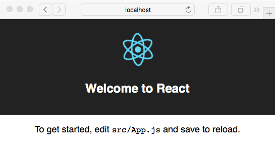

[<< Extension Structure](./structure.md) 
[Build the App UI >>](./build_app_ui.md)

---

## Creating a new React.js project

### Requirements

You need [Node.js](https://nodejs.org) installed. You can find installers on the homepage. The installer also installs npm, the Node package manager on you your system. Allow the installer to add the `node` and `npm` commands to your PATH to access the new tools from the command line.

With this in place you can install [create-react-app](https://github.com/facebookincubator/create-react-app) and [yarn](https://yarnpkg.com/en/), an improved package manager for Node. This is the new canonical way to set up a new React app with all the bells and whistles. Type the following command to install the new tools:

    $ npm install -g create-react-app
    $ npm install -g yarn

> Note: On Mac OS you will have to prepend the commands with `sudo` to allow a system wide installation.

With the Node and React development tools installed we can use `create-react-app` to generate the file structure for a new React project. All Javascript development will happen here. At the end we use the features of `create-react-app` to generate an optimized bundle of files which we copy to the `html` folder of the SketchUp extension. Let's begin by creating a default React app in a new directory:

    $ create-react-app my-react-app

`my-react-app` is both the name of the new app and the folder in which all the files will be created. This command will take a while to install all Javascript dependencies for the development environment. At the end it will print a handy summary of the next commands to run:

```
Success! Created my-react-app at /path/to/your/my-react-app
Inside that directory, you can run several commands:

  yarn start
    Starts the development server.

  yarn build
    Bundles the app into static files for production.

  yarn test
    Starts the test runner.

  yarn eject
    Removes this tool and copies build dependencies, configuration
    files and scripts into the app directory.
    If you do this, you can’t go back!

We suggest that you begin by typing:

  cd my-react-app
  yarn start

Happy hacking! 
```

Follow the last two commands to change into the newly create directory and start the development server on port 3000. A new browser window with the **Welcome to React** page will open up.



It may not look like much but this page has all elements of a working React *Single Page Application*. Our goal is to bundle up this page into a portable format that we can copy to the Ruby extension folder and load into a new UI::HtmlDialog window.

### Modifying the basic app

Before we can create an app package that works from within SketchUp we need to make a few modifications to the basic app template. 

#### package.json

Open the file `package.json` in the root directory of the app in an editor and add a `homepage` key to JSON object like below: 

```javascript
...
"devDependencies": {
  "react-scripts": "1.0.10"
},
"homepage": "./html/",
"scripts": {
  "start": "react-scripts start",
  "build": "react-scripts build",
...
```

The value for the `homepage` setting depends on the name of directory that we chose for our HTML content (`html` in our case). We will make this the root directory of the HTML page and the bundling tool will use this setting to adjust the file paths of our bundled assets.

#### public/index.html

As mentioned above, we need to add a placeholder to the `index.html` template to substitute the path of the extension directory during runtime. The template was generated for us in the `public` folder of our project. Add the new `<base href="BASEURL/">` tag to the `<head>` section of the page, including the trailing slash (`/`).

```html
...
  <title>React App</title>
  <base href="BASEURL/">
</head>
...
```

#### src/index.js

Finally, open the file `src/index.js` and comment out the two lines related to `ServiceWorker`. The service worker is responsible for the progressive loading of content over a potentially slow internet connection. In our contenxt where the data is loaded from the harddrive there is no use for it.

```javascript
import React from 'react';
import ReactDOM from 'react-dom';
import './index.css';
import App from './App';
//import registerServiceWorker from './registerServiceWorker';

ReactDOM.render(<App />, document.getElementById('root'));
//registerServiceWorker();
```

### Create the HTML bundle

These are all the changes necessary to make the complete React app work with SketchUp's HtmlDialog. To generate the optimized Javascript and CSS bundles we run the `build` task that is part of the `react-scripts` tool. It is already set up in the `package.json` file and available via the `yarn` command. 

    yarn build

The output of the command shows you the path to the final *.js and *.css files. As you can see the file names include a hash. An updated `index.html` file has also been created in the `build` folder and it contains our placeholder for the base url. 


```
File sizes after gzip:

  47.85 KB  build/static/js/main.b4678e87.js
  288 B     build/static/css/main.cacbacc7.css

The project was built assuming it is hosted at ./html/.
You can control this with the homepage field in your package.json.

The build folder is ready to be deployed.

✨  Done in 11.04s.
```

To deploy our files we just need to copy the contents of the build folder into our `html` folder. 

    cp -r ./build/* <path-to-Plugins-folder>/sketchup-react-demo/html/

Now we can start SketchUp 2017 and open the HtmlDialog from the new menu entry in `Extensions`. The dialog should look identical to page that we got earlier from the development server. 

### Automatic Deployment

If you use the Github repository to follow along with this tutorial you can use the `deploy_local.js` script in the `utils` folder to build and copy all the files of the extension into the plugins folder of your SketchUp 2017 installation. It is also set up as a npm script in the package.json file so you can run it with 

```
npm run deploy:local
```

## Next steps

We have a working setup with React running inside the HtmlDialog window. React doesn't do much yet and we have not set up any form of interaction with SketchUp. We will address these in the next parts of this tutorial.

---

[<< Extension Structure](./structure.md) 
[Build the App UI >>](./build_app_ui.md)
