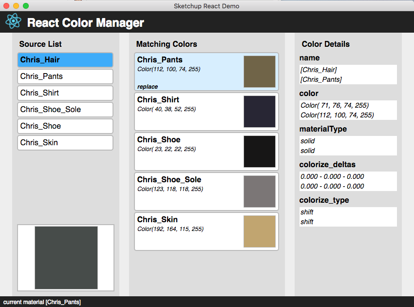

## SketchUp React Demo App

SketchUp 2017 has introduced the new class *UI::HtmlDialog* to display HTML content from a Ruby script. Unlike its predecessor - *UI::WebDialog* - the new class is based on *Chromium* which supports modern HTML5 and Javascript on Windows and Mac OS. With this dialog as platform we can use the latest JavaScript technologies to write complex user interfaces and benefit from new features like ES6 syntax or hot module reloading. 

### Content

[Structure of the SketchUp Extension](./structure.md)

[Creating a basic *React.js* project](./create_react_app.md)

[Building the User Interface](./build_app_ui.md)

[Connecting Ruby and JavaScript](./connect_ruby_with_js.md)

[Connecting the User Interface](./connect_app.md)

### The App

For the purpose of this tutorial we will create a simple app that helps to reduce the number of materials used in a model. It shows the list of model materials (**Source List**) to the left and a list of **Matching Colors** in the center. The matches are sorted by their [CIEDE2000](https://en.wikipedia.org/wiki/Color_difference#CIEDE2000) color difference to the selected source material.

When both a source and a match are selected, their **Color Details** are displayed in the right panel. The match also displays a ***replace*** link that will use a Ruby function to replace all uses of the match with the source material. 

### Resources

The source code for this extension is available in the [GitHub repo](https://github.com/tbleicher/sketchup-react-demo).

A short but intens introduction to *React.js* is available in [this Medium article](https://medium.freecodecamp.org/all-the-fundamental-react-js-concepts-jammed-into-this-single-medium-article-c83f9b53eac2).

---
[back to top](./index.md)
[Next: Extension Structure >>](./structure.md)
